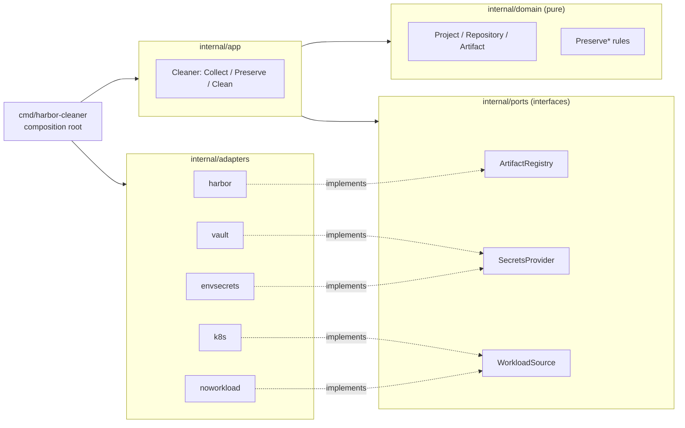

# harbor-cleaner

A retention/garbage-collection engine for a [Harbor](https://goharbor.io/) container registry.

Container registries only grow: every CI build pushes a new image, and nothing
ever deletes the old ones. harbor-cleaner scans a Harbor registry, decides
which artifacts are safe to remove using a small set of composable retention
rules, and deletes (or dry-runs, or soft-deletes to a "trash" project) the
rest.

## What it does

1. **Collect** - fetch every project/repository/artifact from Harbor (or just
   the ones you name).
2. **Preserve** - apply retention rules in order; each one flags artifacts as
   "keep":
   - currently referenced by a Kubernetes workload (optional)
   - belongs to an explicitly allow-listed project or repository
   - pushed within the last N days
   - among the freshest N artifacts in its repository
3. **Clean** - delete everything left unmarked, either for real, moved to a
   garbage project, or (in `dry-run` mode) not at all - just logged.

## Architecture

The codebase follows a ports & adapters (hexagonal) layout: the retention
rules are pure functions with zero knowledge of Harbor, Vault, or Kubernetes.
Everything external is an interface the core depends on, never a concrete
client.



| Port | Adapters | Notes |
|---|---|---|
| `ArtifactRegistry` | `adapters/harbor` | The one required dependency - there's no cleaner without a registry to clean. |
| `SecretsProvider` | `adapters/vault`, `adapters/envsecrets` | Vault is optional; plain env vars work just as well. |
| `WorkloadSource` | `adapters/k8s`, `adapters/noworkload` | Optional. The k8s adapter reads Deployment/StatefulSet/DaemonSet/Job/CronJob pod templates - not live Pods - so scale-to-zero workloads and CronJobs between runs are still correctly treated as "in use". |

`internal/domain` and `internal/ports` never import Harbor/Vault/Kubernetes
SDKs. `internal/app` wires ports to the domain. Only `cmd/harbor-cleaner`
knows about every concrete adapter at once.

## Quick start (no external dependencies except Harbor)

```bash
export HARBOR_REGISTRY_USER_RO=admin
export HARBOR_REGISTRY_PASSWORD_RO=Harbor12345

go run ./cmd/harbor-cleaner \
  --secrets-provider=env \
  --workload-source=none \
  --delete-mode=dry-run \
  --projects-to-clean=all
```

This runs entirely without Vault or Kubernetes: credentials come from env
vars, and retention falls back to the age/top-N/allow-list rules. Point
`harbor-url-api` in `configs/example.yml` (or override via a config file of
your own, see below) at any Harbor instance to try it against real data.

### Configuration

Copy [`configs/example.yml`](configs/example.yml) to `configs/<name>.yml` and
run with `--config-name=<name>`, or override individual fields with
`--<flag>` / edit the YAML directly - every field has a matching CLI flag
(see `internal/config/config.go`). The example file documents every option
inline.

## Testing

- `go test ./...` runs the unit test suite: pure retention-rule tests in
  `internal/domain`, orchestration tests against fake adapters in
  `internal/app`, and a Kubernetes-workload test against a fake clientset in
  `internal/adapters/k8s` (fixtures include a scale-to-zero Deployment and an
  unfired CronJob, to guard the fix described above).
- `go test -tags=integration ./...` additionally runs the Harbor adapter's
  integration test, which spins up a real Harbor via
  [testcontainers-go](https://golang.testcontainers.org/) and exercises
  `ArtifactRegistry` against it end to end. Requires Docker; slow (Harbor is a
  multi-container application), so it's kept out of the default test run.

## CI

[`.github/workflows/ci.yml`](.github/workflows/ci.yml) builds, vets, and runs
the unit test suite on every push. [`.gitlab-ci.yml`](.gitlab-ci.yml) is the
original pipeline shape the tool was operated under in production (sanitized
of any company-specific values) - a real example of wiring this into a
scheduled/manual GitLab CI job.

## Container image

```bash
docker build -t harbor-cleaner .
docker run --rm -e HARBOR_REGISTRY_USER_RO=admin -e HARBOR_REGISTRY_PASSWORD_RO=Harbor12345 \
  harbor-cleaner --secrets-provider=env --workload-source=none --delete-mode=dry-run
```
