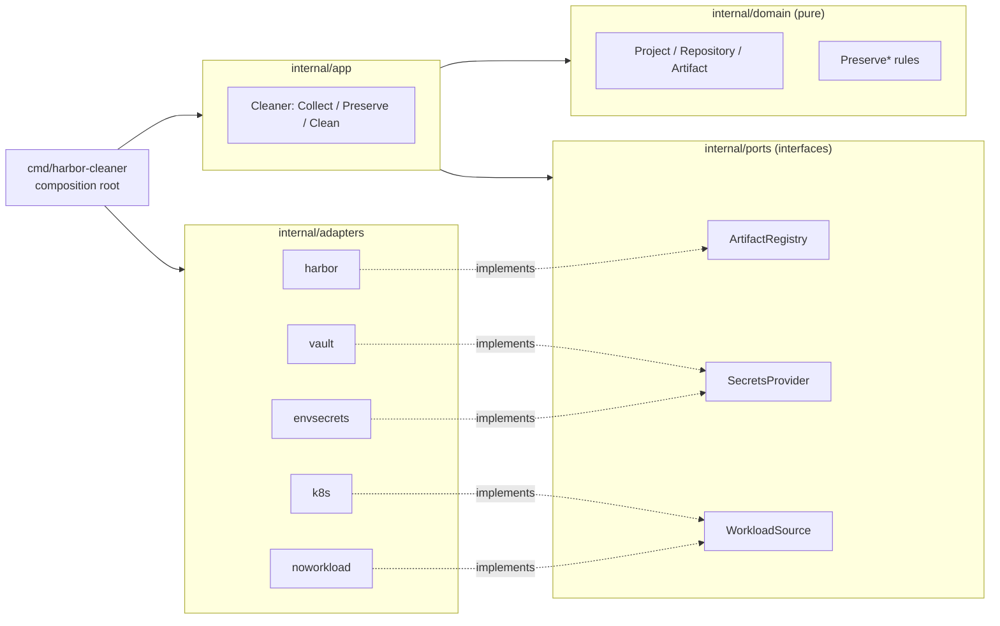

# harbor-cleaner

A retention/garbage-collection engine for a [Harbor](https://goharbor.io/) container registry.

Container registries only grow: every CI build pushes a new image, and nothing
ever deletes the old ones. harbor-cleaner scans a Harbor registry, decides
which artifacts are safe to remove using a small set of composable retention
rules, and deletes (or dry-runs, or soft-deletes to a "trash" project) the
rest.

## What it does

1. **Collect** - fetch every project/repository/artifact from Harbor (or just
   the ones you name).
2. **Preserve** - apply retention rules in order; each one flags artifacts as
   "keep":
   - currently referenced by a Kubernetes workload (optional)
   - belongs to an explicitly allow-listed project or repository
   - pushed within the last N days
   - among the freshest N artifacts in its repository
3. **Clean** - delete everything left unmarked, either for real, moved to a
   garbage project, or (in `dry-run` mode) not at all - just logged.

## Architecture

The codebase follows a ports & adapters (hexagonal) layout: the retention
rules are pure functions with zero knowledge of Harbor, Vault, or Kubernetes.
Everything external is an interface the core depends on, never a concrete
client.



| Port | Adapters | Notes |
|---|---|---|
| `ArtifactRegistry` | `adapters/harbor` | The one required dependency - there's no cleaner without a registry to clean. |
| `SecretsProvider` | `adapters/vault`, `adapters/envsecrets` | Vault is optional; plain env vars work just as well. |
| `WorkloadSource` | `adapters/k8s`, `adapters/noworkload` | Optional. The k8s adapter reads Deployment/StatefulSet/DaemonSet/Job/CronJob pod templates - not live Pods - so scale-to-zero workloads and CronJobs between runs are still correctly treated as "in use". |

`internal/domain` and `internal/ports` never import Harbor/Vault/Kubernetes
SDKs. `internal/app` wires ports to the domain. Only `cmd/harbor-cleaner`
knows about every concrete adapter at once.

### Project layout

```
cmd/harbor-cleaner/   composition root - the only place that knows every adapter
internal/domain/      pure data model + retention rules, zero external deps
internal/app/         Cleaner: orchestrates Collect -> Preserve -> Clean
internal/ports/       interfaces the app depends on (ArtifactRegistry, SecretsProvider, WorkloadSource)
internal/adapters/    concrete implementations of the ports (harbor, vault, envsecrets, k8s, noworkload)
internal/config/      YAML + flag/env config loading and validation
utils/                generic concurrency helpers shared across adapters (see below)
configs/              example YAML config
```

### Concurrency model

Two small generic helpers in `utils/` carry all the fan-out logic, so no
adapter hand-rolls goroutine/channel plumbing:

- **`FetchConcurrently[T any]`** (`utils/concFetcher.go`) - drives a paginated
  Harbor list endpoint with a fixed pool of `numOfWorkers` goroutines pulling
  page numbers off a shared atomic counter, each retried on transient errors.
  All workers write to two shared channels (results, errors); a single
  `select` loop drains both into slices, so no lock is needed anywhere. If one
  worker hits an unretryable error, it cancels the shared context so the rest
  stop paginating instead of wasting further requests whose results would be
  thrown away anyway.
- **`Gather[I, O any]`** (`utils/gather.go`) - the fan-out shape used by
  `adapters/harbor` (one goroutine per repo), `adapters/k8s` (one per
  cluster), and `adapters/vault` (one per cluster's kubeconfig secret): run a
  function once per item in an unbounded set of goroutines, collect results in
  the same order as the input. Each goroutine writes to its own slice index,
  so - again - no lock needed; only errors travel over a channel.

`internal/app.Cleaner.Clean` uses a conventional bounded worker pool (N
goroutines pulling from a channel of artifacts) for deletes, and aggregates
every failure via `errors.Join` instead of surfacing only the first one it
saw.

## Quick start (no external dependencies except Harbor)

```bash
export HARBOR_REGISTRY_USER_RO=admin
export HARBOR_REGISTRY_PASSWORD_RO=Harbor12345

go run ./cmd/harbor-cleaner \
  --secrets-provider=env \
  --workload-source=none \
  --delete-mode=dry-run \
  --projects-to-clean=all
```

This runs entirely without Vault or Kubernetes: credentials come from env
vars, and retention falls back to the age/top-N/allow-list rules. Point
`harbor-url-api` in `configs/example.yml` (or override via a config file of
your own, see below) at any Harbor instance to try it against real data.

### Configuration

Copy [`configs/example.yml`](configs/example.yml) to `configs/<name>.yml` and
run with `--config-name=<name>`, or override individual fields with
`--<flag>` / edit the YAML directly - every field has a matching CLI flag
(see `internal/config/config.go`). The example file documents every option
inline. A few of the most consequential ones:

| Flag | Default | Meaning |
|---|---|---|
| `--delete-mode` | `dry-run` | `dry-run` (GET only), `soft-delete` (move to garbage project), `hard-delete` (gone for good) |
| `--pushed-days-ago` | `90` | Artifacts younger than this are always kept (minimum 9) |
| `--top-age` | `3` | The N freshest artifacts per repo are always kept |
| `--workload-source` | `none` | `k8s` preserves images live in a cluster; `none` relies only on age/top-N/allow-list |
| `--secrets-provider` | `vault` | `vault` or `env` for Harbor credentials |
| `--projects-to-clean` | - | Comma-separated project names, or `all` |

`internal/config.Validate` rejects an inconsistent combination (e.g.
`workload-source=k8s` with no clusters listed, or a `soft-delete` target that's
also in the clean list) before anything talks to Harbor.

## Testing

```bash
go test ./...                              # unit suite, no external services
go test ./... -race                        # same, with the race detector
go test -tags=integration ./...            # + real Harbor via testcontainers (needs Docker)
go test -tags="integration load" ./internal/adapters/harbor/... \
  -run TestHarborRegistryBulkHardDelete -timeout 15m   # bulk-delete load test (needs Docker)
```

- **Unit tests** cover the pure retention rules (`internal/domain`),
  `Cleaner` orchestration against a fake `ArtifactRegistry`/`WorkloadSource`
  (`internal/app`), the concurrency helpers (`utils`, including a worker-count
  bound and a fail-fast-on-error check for `FetchConcurrently`), config
  validation (`internal/config`), and every adapter's non-network logic -
  Vault/Harbor client construction and auth flows are exercised against
  `httptest` fakes rather than mocked out, so a wire-format regression in, say,
  the JWT login response would still be caught. No test hits a real network or
  cluster.
- **`-tags=integration`** additionally builds and runs
  `internal/adapters/harbor/registry_integration_test.go`, which spins up a
  real Harbor via [testcontainers-go](https://golang.testcontainers.org/) and
  drives `ArtifactRegistry` against it end to end: list, push, fake-delete,
  hard-delete, move-to-another-project (soft-delete), and a repeat delete on an
  already-gone artifact - checking that Harbor's real 404 response is
  recognized by its typed status code, not by string-matching the error text.
  Requires Docker; slow (Harbor is a multi-container application), so it's
  kept out of the default test run.
- **`-tags="integration load"`** additionally builds
  `internal/adapters/harbor/registry_load_test.go`: pushes ~1000 distinct
  synthetic artifacts straight over the registry HTTP API (via
  [go-containerregistry](https://github.com/google/go-containerregistry), not
  `docker push` - far too slow per image at this volume) and hard-deletes all
  of them through the real `Cleaner.Clean` pipeline, to catch worker-pool
  starvation or pagination bugs that only show up at volume. It needs both
  tags because it reuses the plain integration test's Harbor bring-up helpers.
  Opt-in and not run by `-tags=integration` alone; expect a few minutes.

## CI

[`.github/workflows/ci.yml`](.github/workflows/ci.yml) builds, vets, and runs
the unit test suite on every push. [`.gitlab-ci.yml`](.gitlab-ci.yml) is the
original pipeline shape the tool was operated under in production (sanitized
of any company-specific values) - a real example of wiring this into a
scheduled/manual GitLab CI job.

## Container image

```bash
docker build -t harbor-cleaner .
docker run --rm -e HARBOR_REGISTRY_USER_RO=admin -e HARBOR_REGISTRY_PASSWORD_RO=Harbor12345 \
  harbor-cleaner --secrets-provider=env --workload-source=none --delete-mode=dry-run
```

## License

[Apache License 2.0](LICENSE).
